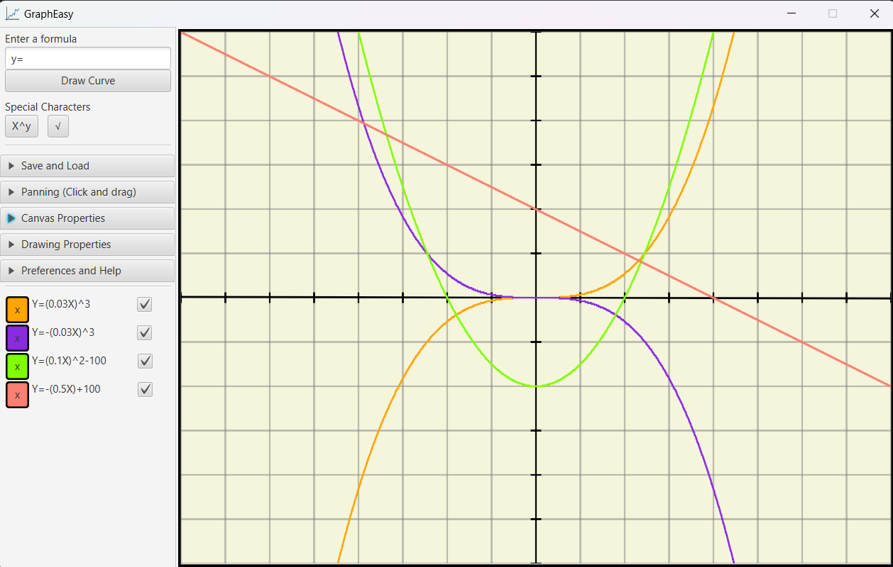

# GraphEasy - JavaFX App
GraphEasy is a Simple, educational tool for visualising formulas on a graph. It is written using Java and JavaFX (and currently unfinished).

The user can enter a formula in the text box, and press the button to add it to the canvas. There are controls below the textbox for adding special characters, toggles for various UI elements, and so on.

The user can click and drag on the canvas to pan around. The program will automatically recalculate and redraw the axes, the background, and all curves.

Icons used:
<a href="https://www.flaticon.com/free-icons/graph" title="graph icons">Graph icons created by Pixel perfect - Flaticon</a>
